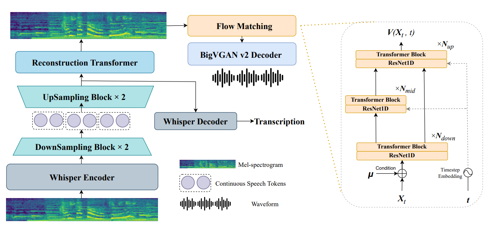
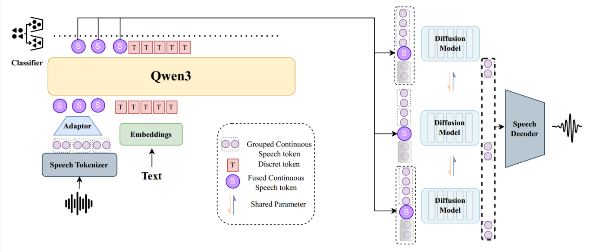

Speech Language Models (SpeechLMs) are Large Language Models (LLMs) that can directly process both speech input and speech output, establishing a more natural framework for human-machine interaction. Traditional approaches employ speech encoders with vector-quantization modules to discretize continuous speech signals into tokens, allowing LLMs to unify the modeling of text and speech tokens. However, the inherent conflict between speech's continuous nature and text's discrete essence, coupled with speech data's substantially lower information density when compared to text data, poses significant challenges for these models. In this work, we propose a novel model and training methodology to enable joint generation of discrete and continuous tokens. Our autoregressive model features a bi-level whole-part architecture comprising a large transformer for long-range dependency modeling and a small diffusion transformer that generates continuous speech tokens using local information. Experimental results demonstrate that the proposed model achieves performance comparable to discrete token-based SpeechLMs while requiring fewer training tokens.

# Speech Encoder & Decoder Reconstruction Results

<table style="width: 90%; margin: auto;">
    <colgroup>
        <col style="width: 50%;">
        <col style="width: 50%;">
    </colgroup>
    <thead>
        <tr>
            <th>Ground Truth</th>
            <th>Reconstructed Audio </th>
        </tr>
    </thead>
    <tbody>
        <tr>
            <td>
                <audio controls preload="auto">
                    <source src="audio/reconstruct/gt1.wav">
                </audio>
            </td>
            <td>
                <audio controls preload="auto">
                    <source src="audio/reconstruct/gen1.wav">
                </audio>
            </td>
        </tr>
        <tr>
            <td>
                <audio controls preload="auto">
                    <source src="audio/reconstruct/gt2.wav">
                </audio>
            </td>
            <td>
                <audio controls preload="auto">
                    <source src="audio/reconstruct/gen2.wav">
                </audio>
            </td>
        </tr>
        <tr>
            <td>
                <audio controls preload="auto">
                    <source src="audio/reconstruct/gt3.wav">
                </audio>
            </td>
            <td>
                <audio controls preload="auto">
                    <source src="audio/reconstruct/gen3.wav">
                </audio>
            </td>
        </tr>
        <tr>
            <td>
                <audio controls preload="auto">
                    <source src="audio/reconstruct/gt4.wav">
                </audio>
            </td>
            <td>
                <audio controls preload="auto">
                    <source src="audio/reconstruct/gen4.wav">
                </audio>
            </td>
        </tr>
        <tr>
            <td>
                <audio controls preload="auto">
                    <source src="audio/reconstruct/gt5.wav">
                </audio>
            </td>
            <td>
                <audio controls preload="auto">
                    <source src="audio/reconstruct/gen5.wav">
                </audio>
            </td>
        </tr>
        <tr>
            <td>
                <audio controls preload="auto">
                    <source src="audio/reconstruct/gt6.wav">
                </audio>
            </td>
            <td>
                <audio controls preload="auto">
                    <source src="audio/reconstruct/gen6.wav">
                </audio>
            </td>
        </tr>
        <tr>
            <td>
                <audio controls preload="auto">
                    <source src="audio/reconstruct/gt7.wav">
                </audio>
            </td>
            <td>
                <audio controls preload="auto">
                    <source src="audio/reconstruct/gen7.wav">
                </audio>
            </td>
        </tr>
        <tr>
            <td>
                <audio controls preload="auto">
                    <source src="audio/reconstruct/gt8.wav">
                </audio>
            </td>
            <td>
                <audio controls preload="auto">
                    <source src="audio/reconstruct/gen8.wav">
                </audio>
            </td>
        </tr>
    </tbody>
</table>

# Speech Language Model Results

<table style="width: 90%; margin: auto;">
    <colgroup>
        <col style="width: 50%;">
        <col style="width: 50%;">
    </colgroup>
    <thead>
        <tr>
            <th>Input</th>
            <th>Continuation</th>
        </tr>
    </thead>
    <tbody>
    <tr>    
        <td>
            <audio controls preload="auto">
                <source src="audio/speech/q3.wav">
            </audio>
        </td>
        <td>
            286 km of the Himalayas. The peak is 8,848 meters above sea level and its mass is about 90 million tonnes. It is the highest point in the world that can be reached by airplane. The summit has been climbed 17 times and the last time was in 1953.
        </td>
    </tr>
    <tr>    
        <td>
            <audio controls preload="auto">
                <source src="audio/speech/q4.wav">
            </audio>
        </td>
        <td>
            The key unlocked a hidden room that led to a treasure chest filled with shiny coins and rare artifacts. As they explored the room, they found a mysterious journal inside. The journal revealed that the key had been stolen from a treasure hunt and that the treasure was hidden in a hidden forest. Lucy and Tom decided to take the journal with them and search for the hidden forest. They set out on a thrilling journey through the forest, encountering various creatures and obstacles. Eventually, they found the treasure chest and the hidden forest was there. They spent the rest of the day exploring the forest and discovering new treasures.
        </td>
    </tr>
    <tr>
        <td>
           Once upon a time, in a small house, there was a cat and a dog.
        </td>
        <td>
            <audio controls preload="auto">
                <source src="audio/speech/r5.wav">
            </audio>
        </td>
    </tr>
    <tr>
        <td>
           Here is a brief introduction to the magnetic field of Earth.
        </td>
        <td>
            <audio controls preload="auto">
                <source src="audio/speech/r6.wav">
            </audio>
        </td>
    </tr>
    <tr>
        <td>
           <audio controls preload="auto">
                <source src="audio/speech/q1.wav">
            </audio>
        </td>
        <td>
            <audio controls preload="auto">
                <source src="audio/speech/r1.wav">
            </audio>
        </td>
    </tr>
    <tr>
        <td>
           <audio controls preload="auto">
                <source src="audio/speech/q2.wav">
            </audio>
        </td>
        <td>
            <audio controls preload="auto">
                <source src="audio/speech/r2.wav">
            </audio>
        </td>
    </tr>
    </tbody>
    
</table>